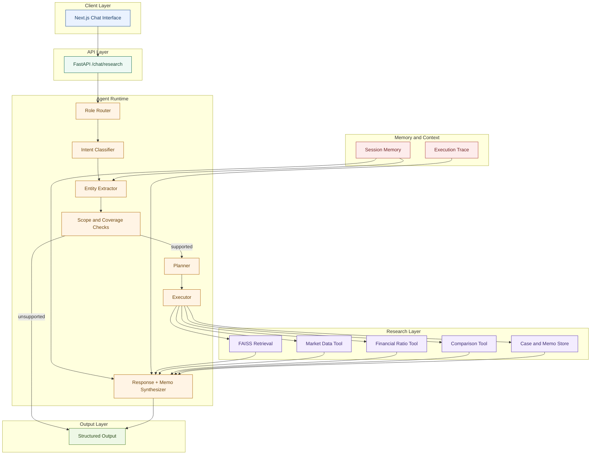

# 💼 Investment Committee Copilot

> An agentic research assistant that turns a plain-language investment question into a grounded, structured answer — backed by retrieved filings, live market data, and deterministic tools, never by the model's own memory.

---

## The Problem

Investment research means bouncing between three places that do not naturally connect:

| Need | Usually lives in |
|---|---|
| Quantitative market data | A terminal or spreadsheet |
| Evidence from filings | A PDF reader |
| Analytical synthesis | A blank document |

This project puts all three behind a single agent while keeping them structurally separate internally. Numbers come from tools. Evidence comes from retrieval. The language model only reasons over what it is handed and does not rely on unsupported memory.

---

## What It Does

- **Company deep-dives** — grounded analysis combining filings and market data.
- **Peer comparisons** — structured tables across market and ratio tools.
- **Metric lookups** — single-value answers such as P/E, ROE, and revenue growth.
- **Investment memo generation** — thesis, risks, financials, and citations in one structured output.
- **Reference resolution** — phrases like "the second one" or "both of them" are resolved from session history.
- **Scoped refusals** — unsupported companies and out-of-scope requests are caught instead of guessed.
- **Multi-intent handling** — requests like "compare these and draft a memo" are executed as ordered steps.

---

## Two Personas, One Agent

| Persona | Can do | Role enforcement |
|---|---|---|
| Analyst | Analyze a company, compare companies, look up metrics, generate memos | Intent set scoped to `analyst` |
| Manager | Review the pending-memo queue, ask follow-ups, approve or reject decisions | Intent set scoped to `manager` |

Role is checked before intent classification runs. A manager-only action is never offered to an analyst session, and vice versa.

---

## Architecture



This architecture separates the agent runtime from the evidence layer and the response layer. The language model participates only after the system has gathered grounded facts and a clear execution plan.

---

## Request Lifecycle

1. **Role router** — decides which intents are legal for the current session before any work begins.
2. **Intent classifier** — returns all distinct tasks in the message, in order, with support for multi-intent queries.
3. **Entity extractor** — resolves company names, tickers, and conversational references against recent session history.
4. **Scope check** — unsupported company or clearly out-of-scope requests are blocked without unnecessary tool calls.
5. **Planner** — builds a deterministic tool plan from the resolved intents and entities.
6. **Executor** — runs the plan and collects RAG evidence, market data, ratios, comparison data, and execution trace information.
7. **Synthesizer** — generates either a concise textual response or analytical memo content grounded in the data actually retrieved.

> Memo generation is the one exception worth noting: the LLM only provides the analytical fields such as thesis, confidence, summary, and risk framing. Every number in the memo, including market data and comparison values, is assembled separately from tool output and never passed through the model.

---

## Design Decisions

| Decision | Why |
|---|---|
| Separate planner from LLM | The same input always yields the same tool plan, which improves auditability and consistency. |
| Keep memo numbers outside the model | Hallucinated figures are prevented because the data layer assembles factual values before response generation. |
| Use chunked document retrieval | Retrieval stays inspectable and grounded in specific sections instead of broad, vague model memory. |
| Keep mock market data behind a switch | Live providers can be swapped in without changing the calling code. |
| Enforce role checks before intent classification | Privilege boundaries are applied structurally rather than by prompting alone. |

---

## Guardrails

- Planner never decides what to fetch, only whether a fixed operation applies.
- Memo factual fields do not pass through the LLM.
- Role-scoped intents block cross-persona actions before tool execution.
- Unsupported companies receive a direct coverage response instead of a guessed answer.
- Out-of-scope and adversarial questions are explicitly refused and contained.

---

## Evaluation

Two complementary passes support evaluation:

| Layer | Checks |
|---|---|
| Deterministic / gold dataset | Intent accuracy, ticker resolution, and planner correctness |
| LLM-as-judge | Relevance, groundedness, and completeness of final responses |

The evaluation set covers `happy_path`, `ambiguous`, `edge_case`, and `adversarial` flows.

---

## Project Structure

```text
backend/
├── app/
│   ├── main.py                     # FastAPI entry point
│   ├── config.py                   # Settings and environment mapping
│   ├── api/
│   │   └── routes_chat.py          # /chat/research endpoint
│   ├── agents/
│   │   ├── graph.py                # LangGraph workflow wiring
│   │   ├── state.py                # Shared agent state
│   │   ├── role_router.py
│   │   ├── intent_classifier.py
│   │   ├── entity_extractor.py
│   │   ├── planner.py
│   │   ├── executor.py
│   │   ├── response_synthesizer.py
│   │   ├── memo_synthesizer.py
│   │   ├── llm_client.py
│   │   └── tools/
│   │       ├── rag_tool.py
│   │       ├── market_tool.py
│   │       ├── ratios_tool.py
│   │       ├── comparison_tool.py
│   │       ├── memo_tool.py
│   │       └── case_tool.py
│   ├── rag/
│   │   ├── ingest.py               # Rebuilds the FAISS index
│   │   ├── chunker.py              # Section-aware chunking
│   │   ├── retriever.py
│   │   └── documents/              # Source filings by company
│   ├── memory/
│   │   └── chat_memory.py          # Session-scoped chat history
│   ├── core/
│   │   └── ticker_resolver.py      # Company name to ticker mapping
│   └── models/
│       └── schemas.py              # Request and response contracts
├── mock_data/
│   ├── market_data.json
│   └── investment_cases.json
├── evals/
│   └── deterministic/
├── requirements.txt
└── Dockerfile

frontend/
└── Next.js app
```

---

## Tech Stack

| Layer | Technology |
|---|---|
| Frontend | Next.js |
| API | FastAPI + Uvicorn |
| Orchestration | LangGraph |
| Retrieval | FAISS + HuggingFace embeddings (`all-MiniLM-L6-v2`) |
| Language model | Claude via structured tool-forced calls |
| Data | Local JSON mocks and optional live providers |

---

## Setup

### Backend

```powershell
python -m venv .venv
.\.venv\Scripts\Activate.ps1
pip install -r backend/requirements.txt

cd backend
Copy-Item .env.example .env
```

The application runs on mock data by default, so no API keys are required for local setup unless you intentionally switch to live market data.

```powershell
uvicorn app.main:app --reload --port 8000
```

To switch to live market data, set `USE_MOCK = False` in `market_tool.py` and `ratios_tool.py`, then update `.env` with the relevant keys.

### Frontend

```powershell
cd frontend
npm install
npm run dev
```

Open `http://localhost:3000` in your browser.

---

## Example Queries

| Request | What happens |
|---|---|
| "Compare NVIDIA and AMD and draft a memo for NVIDIA." | Comparison and memo are executed as ordered steps. |
| "What's NVDA's P/E?" | A single metric lookup is returned in a structured format. |
| "Now make a memo for the second one." after a prior comparison | The entity resolver uses chat history to resolve the reference. |
| "How is Tesla doing?" | Unsupported company coverage is returned instead of a fabricated answer. |
| "What do you think about the chip sector right now?" | The request is refused as out of scope. |

---

## Current Limitations

- Retrieval corpus is small and synthetic rather than a full live filings repository.
- Market and ratio data are mocked by default.
- Persistence uses JSON files rather than a production database or auth layer.
- Manager approval and revision actions are scaffolded rather than fully wired to the UI.

## Next Steps

- [ ] Add a real database and authentication layer.
- [ ] Connect manager approval, rejection, and revision flows to the frontend.
- [ ] Add scheduled ingestion for new filings and documents.
- [ ] Replace mock market data with a live provider behind the existing switch.
